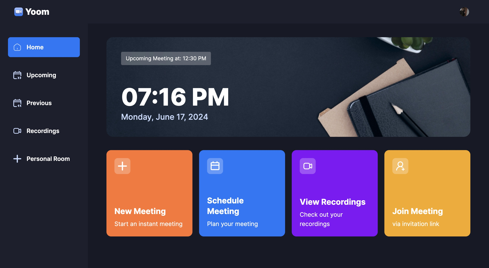

# ZOOM CLONE PROJECT

## <a name="tech-stack">⚙️ Tech Stack</a>

- Next.js
- TypeScript
- Clerk
- getstream
- shadcn
- Tailwind CSS

## <a name="features">🔋 Features</a>

👉 **Authentication**: Implements authentication and authorization features using Clerk, allowing users to securely log in via social sign-on or traditional email and password methods, while ensuring appropriate access levels and permissions within the platform.

👉 **New Meeting**: Quickly start a new meeting, configuring camera and microphone settings before joining.

👉 **Meeting Controls**: Participants have full control over meeting aspects, including recording, emoji reactions, screen sharing, muting/unmuting, sound adjustments, grid layout, participant list view, and individual participant management (pinning, muting, unmuting, blocking, allowing video share).

👉 **Exit Meeting**: Participants can leave a meeting, or creators can end it for all attendees.

👉 **Schedule Future Meetings**: Input meeting details (date, time) to schedule future meetings, accessible on the 'Upcoming Meetings' page for sharing the link or immediate start.

👉 **Past Meetings List**: Access a list of previously held meetings, including details and metadata.

👉 **View Recorded Meetings**: Access recordings of past meetings for review or reference.

👉 **Personal Room**: Users have a personal room with a unique meeting link for instant meetings, shareable with others.

👉 **Join Meetings via Link**: Easily join meetings created by others by providing a link.

👉 **Secure Real-time Functionality**: All interactions within the platform are secure and occur in real-time, maintaining user privacy and data integrity.

👉 **Responsive Design**: Follows responsive design principles to ensure optimal user experience across devices, adapting seamlessly to different screen sizes and resolutions.

and many more, including code architecture and reusability.

##

